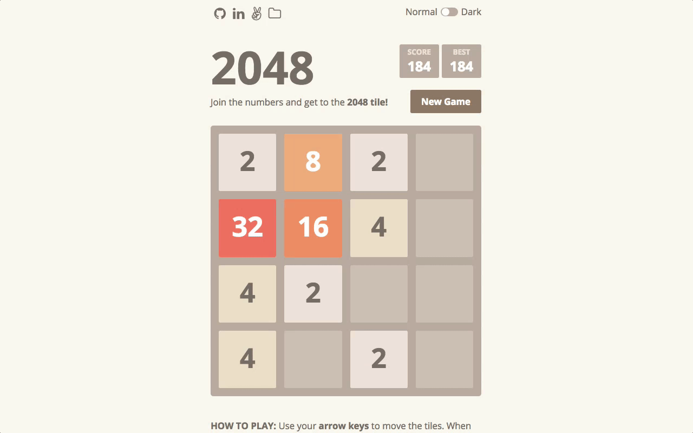
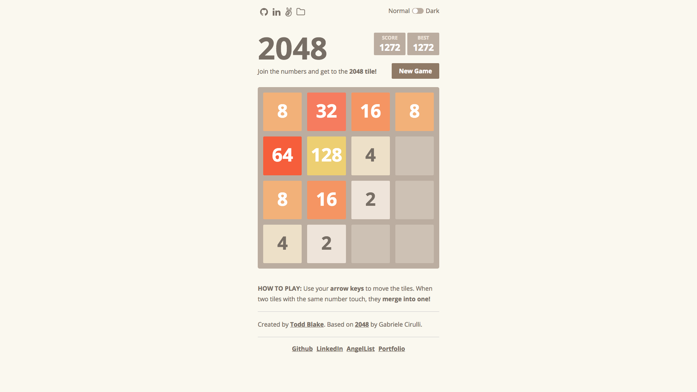
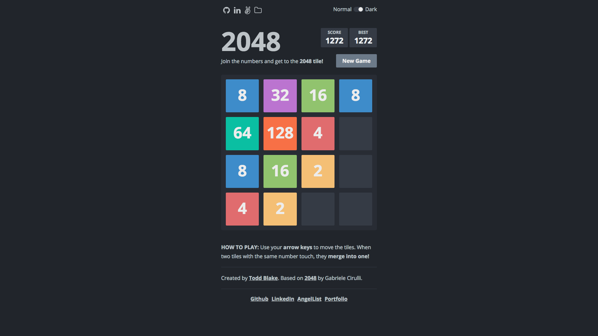

# 2048

[Play][play]
[play]: http://toddkblake.com/2048

2048 is a sliding-block puzzle game inspired by the original 2048 by Gabrielle Cirulli.

## Features & Implementation

In order to enable for consistent gameplay and an interactive UI, 2048 separates the game logic from the game rendering.

### Game Logic

The game logic is handled in vanilla JavaScript using object-oriented design. A `game`, `grid` and `tile` class are responsible for maintaining the current state of the game's logic.

### Game Rendering

In rendering the game state to the DOM, 2048 implements a `GameContainer` React Component which links the game logic state to three functional React Components `Header`, `Tiles` and `Tile` which are responsible for displaying the current game state.

The `GameContainer` is responsible for listening to key events from the user, updating the game state and only re-rendering when the state of the game has changed.

By leveraging React's virtual DOM 'diffing' algorithm, only those `Tiles` whose state (position or value) have been modified are modified and re-rendered.

```javascript
const Tile = ({ tile }) => {
  const merged = tile.merged ? 'merged' : '';
  return (
    <div className={ `tile pos-${tile.row}-${tile.col} value-${tile.value} ${ merged }` }>
      <span>{ tile.value }</span>
    </div>
  );
}
```

## User Interface (UI) and User Experience (UX)
Part of what makes 2048 so addicting is it's incredibly interactive UI/UX. In order to slide tiles up, down, left or right, the user simply presses the corresponding arrow key.



### CSS Transitions & Animations

From tiles merging together to new ones appearing, 2048 utilizes CSS transitions, animations and ReactCSSTransitionGroup for an engaging and intuitive user experience.

```css
/* ANIMATIONS */

.merged {
  animation: merge 0.2s linear;
}

@-webkit-keyframes merge {
  0%    { transform: scale(1, 1) }
  50%   { transform: scale(1.2, 1.2) }
  100%  { transform: scale(1, 1) }
}

@keyframes merge {
  0%    { transform: scale(1, 1) }
  50%   { transform: scale(1.2, 1.2) }
  100%  { transform: scale(1, 1) }
}
```

### Color Mode

For even more beautiful gameplay, 2048 includes a dark mode that allows users to switch the UI color scheme dynamically during game play using a toggle switch.

#### Normal Mode


#### Dark Mode


## Future Directions for the Project

I plan to continue working on this project, aiming to make the game more accessible on mobile devices.

### Touch swiping gestures

In order for mobile users to be able to play 2048, I plan to implement event handlers for touch events that would allows for mobile users to swipe up, down, left or right to play 2048.

### Responsive design

In addition to adding touch gestures, I plan to make a mobile responsive design for screens below 500px width.
