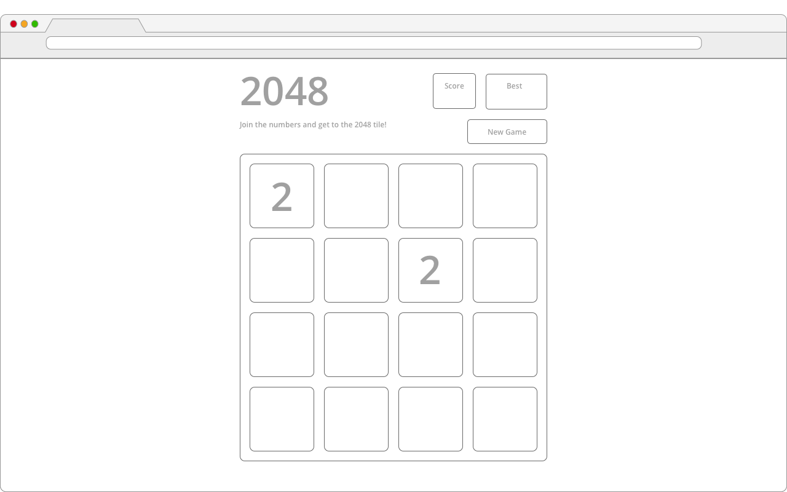

## 2048

### Background

2048 is a sliding-block puzzle game. The objective is to slide numbered tiles on a grid to combine them to create a tile with the number 2048. All tiles have numeric values of exponents of base 2. The game implements the following rules:

1. The game starts with two tiles with the value of 2 or 4 on a 4 x 4 grid.
2. The player can choose to slide all of the tiles up, down, left or right, after which a new tile is randomly generated with the value of 2 or 4.
3. When two tiles collide, if they have the same numeric value, they are combined and their values multiplied together.
4. The game is over if the board is full and the player can make no move.

### Functionality & MVP  

Users will be able to:

- [ ] Start a new game
- [ ] Use the arrow keys to select which direction to slide the tiles in
- [ ] Play game until over
- [ ] See their current score and all-time best score

In addition, this project will include:

- [ ] CSS animations for sliding and colliding tiles
- [ ] A modal upon game over
- [ ] Links to my Portfolio, Github and LinkedIn
- [ ] A production README

### Wireframes

This app will consist of a single screen with game grid, scores, new game button and footer nav links to my Github, Portfolio and LinkedIn.

After the game ends, there will be a modal that appears with a link to restart the game or visit my Github, Portfolio and LinkedIn.

### Architecture and Technologies

This project will be implemented with the following technologies:

- Vanilla `JavaScript` for the game logic
- `React.js`, `HTML` and the native `DOM API` for DOM manipulation and rendering
- `ReactCSSTransitionGroup` and `CSS3` for CSS animations
- Webpack to bundle and serve up the scripts

In addition to the webpack entry file, there will be several scripts involved in this project:

`game.js`: this script will be responsible for handling the game logic, including whether the game is over, the current score, etc.

`grid.js`: will handle storing information about the game's grid, including where empty positions are located and the tiles at each position.

`tile.js`: this script will handle information about each tile, including its value, position and optionally, its previous position or value if merged.

`input.js`: this script will handle binding user input from the keyboard.

`render.jsx`: this script will be responsible for taking the state of the game and rendering the grid and tiles on the DOM.

### Implementation Timeline

**Phase 1**: Setup and install all necessary Node modules, including webpack and `React.js`. Create `webpack.config.js` as well as `package.json`. Write a basic entry file and start of all scripts outlined above. Goals for the day:

- Install `webpack`
- Install `React`
- Create entry file

**Phase 2**: Finish all of the game logic, first building out the `Grid` then `Tile` and finally `Game` objects. Goals for the day:

- Complete the `grid.js` script
- Complete the `tile.js` script
- Complete the `game.js` script

**Phase 3**: Write all of the render and UI logic, including the `input` script for key binding and the React components required for rendering to the DOM.

- Complete `input` key-binding script
- Create React components for the `grid` and `tiles`
- Render tiles to the grid on the DOM
- User ReactCSSTransitionGroup and CSS3 Transitions / keyframes to animate transitions.

### Bonus features

- [ ] Touch swiping gestures
- [ ] Responsive design
